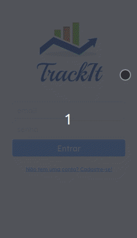

# Trackit

<p align="center">

</p>

A habits tracking app written in React that allows you to improve your discipline!

Try it now [here](https://track-it-1anljlk6k-c137rodrigolima.vercel.app/)

## About

Below are the implemented features on this App:

- Sign Up
- Login
- List of today habits to check.
- List all user habits.
- Form to create new habits, choosen name and days.

Below are the not yet implemented features on this App:

- Historic route with the days sucess ou fail habits on a calenddar. (comming soon)

By using this App, the Client can take a look on his/her objectives and has a checkpoint to self remember.

## Technologies
The following tools and frameworks were used in the construction of the project:<br>
<p>
  
  
  
  
  
  
</p>

## How to run

1. Clone this repository.
4. Install dependencies
```bash
npm i
```
5. Run the front-end with
```bash
npm start
```
6. You can optionally build the project running
```bash
npm run build
```
7. Finally access http://localhost:3000 on your favorite browser.
8. Test It by yourself...